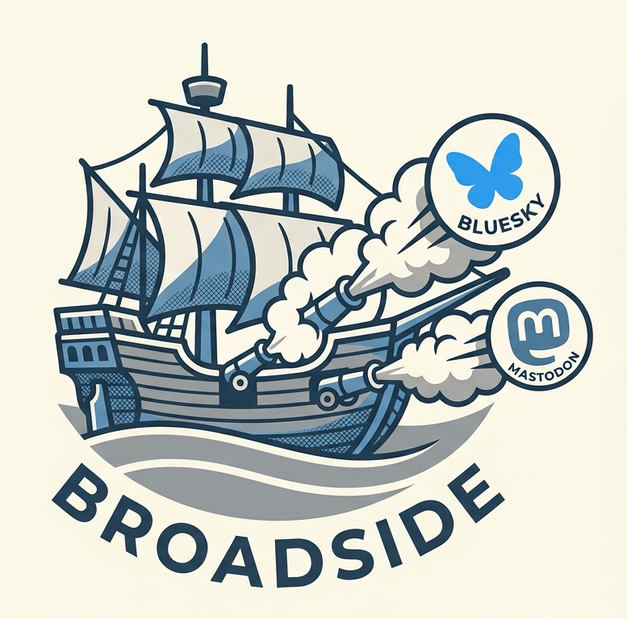

<p align="center">
  
</p>

# Broadside

A self-hosted cross-poster for **Bluesky** and **Mastodon**. Compose once — with
proper alt text — and post the same text and images to multiple accounts across
both platforms in a single action.

Broadside solves one problem well: posting the same content to Bluesky and to one
or more Mastodon accounts without visiting each platform individually, while
**guaranteeing that alt text is always present**. It will not let a post go out
without alt text on every image.

> ⚠️ **Local network use only.** Broadside holds live posting credentials for
> your accounts. It is designed to run on your own hardware on your local
> network and **must never be exposed to the public internet.** See
> [Security](#security).

---

## Features

- **Multiple accounts, both platforms.** Any number of Bluesky and Mastodon
  accounts. Post to all of them, or pick a subset per post.
- **Enforced alt text.** The alt-text field auto-opens and focuses the instant
  an image lands, and a post is hard-blocked until every image has alt text.
- **Threads.** Build an ordered sequence of entries, posted as an independent
  self-reply chain on each selected account.
- **Grapheme-accurate counting.** Character counts match how Bluesky actually
  counts (emoji included), and the binding limit reflects your current selection.
- **Client-side image resizing.** Images are resized in your browser to satisfy
  the tightest selected platform's limits, so full-size originals never transit
  the server.
- **Clickable links on Bluesky.** URLs are auto-detected and made clickable via
  link facets (Bluesky doesn't do this on its own). Mastodon handles links itself.
- **Link preview cards on Bluesky.** An entry with a link and no image gets a
  preview card (title, description, thumbnail), fetched server-side. With an
  image attached there's no card — a Bluesky post has a single embed slot.
- **Live-validated setup.** Every account is verified against its platform before
  it is saved, so bad credentials are caught at setup, not at post time.
- **Clear per-target reporting.** Every selected account gets its own status line
  with a real link on success, a specific reason on failure, and the raw error
  one click away. A durable server-side log keeps the history.

### Not included (by design)

**Other platforms** — this is a Bluesky + Mastodon tool only. It does not post
to Twitter/X, Threads, or any other network, and there are no plans to add them.

Also not included: video and other non-image attachments, mention/hashtag
facets, scheduling, drafts, and analytics. (Bluesky link cards *are* supported
for imageless posts — see Features.) See
[`broadside-spec.md`](broadside-spec.md) for the full scope and rationale.

---

## Requirements

- Docker (recommended), or Python 3.12 / 3.13 for local development. (The
  container image uses Python 3.12. Pillow — a dependency — has no prebuilt
  wheel for Python 3.14 yet, so 3.14 will try to build it from source.)
- A Bluesky **app password** for each Bluesky account
  (Settings → Privacy and Security → App Passwords — **not** your account password).
- A Mastodon **access token** for each Mastodon account
  (Preferences → Development → New Application; the default `read` + `write`
  scopes are sufficient — `read` verifies the account and reads instance limits,
  `write` posts).

---

## Quick start (Docker)

```bash
git clone https://github.com/cruftbox/broadside.git
cd broadside
docker compose up -d --build
```

Then open `http://<host>:8083` on your local network. On first run you'll be
routed to the setup wizard. Add at least one account, verify it, and you're ready
to compose.

Configuration and the post log persist in the `broadside-data` Docker volume, so
they survive restarts.

To change the port, edit the `ports` mapping in
[`docker-compose.yml`](docker-compose.yml).

---

## Local development

```bash
python -m venv .venv
# Windows:  .venv\Scripts\activate
# Unix:     source .venv/bin/activate
pip install -r requirements.txt

# Store config/log under ./data instead of /data, and pick the host port:
export BROADSIDE_DATA_DIR=./data        # PowerShell: $env:BROADSIDE_DATA_DIR="./data"
export BROADSIDE_PORT=8083              # PowerShell: $env:BROADSIDE_PORT="8083"
python -m app.server
```

The dev server binds to `0.0.0.0:8083` here (default is 8080; override with
`BROADSIDE_PORT`). Open `http://localhost:8083`.

---

## Updating a server deployment

[`update.sh`](update.sh) updates an existing server deployment in place: it
fetches the latest code from GitHub as a tarball (no `git` needed — handy on a
NAS), syncs it into the app directory **without touching `data/`**, and rebuilds
the container with `docker compose`. Run it from the app directory on the server:

```bash
./update.sh            # update only if GitHub is ahead of what's deployed
./update.sh --force    # rebuild from the latest commit regardless
./update.sh --check    # report status only (exit 10 if an update is available)
```

For this public repo no token is needed. For a private fork, or to raise
GitHub's unauthenticated API rate limit, put a fine-grained token
(Contents: Read) in `.deploy/github_token` or set `GITHUB_TOKEN`.

> Note: `update.sh` targets a QNAP Container Station host (it falls back to that
> `docker` path and works around a compose config-dir permission quirk). On
> other hosts set the `DOCKER` environment variable to your `docker` binary.

The image bakes in the commit it was built from and compares it to GitHub's
latest, so when the deployment is behind, the composer shows an **"update
available"** banner. Broadside does **not** update itself — applying the update
is a deliberate `./update.sh` run on the server. (A container can't reliably
rebuild its own image from inside itself, so there is intentionally no in-app
"update now" button.)

---

## Setup: getting credentials

**Bluesky app password**
1. In Bluesky: Settings → Privacy and Security → App Passwords.
2. Create a new app password and copy it (format `xxxx-xxxx-xxxx-xxxx`).
3. In Broadside's wizard, enter your handle (e.g. `name.bsky.social`) and the app
   password. Broadside validates it live and caches your account DID.

**Mastodon access token**
1. On your instance: Preferences → Development → New Application.
2. Give it a name, keep the default `read`/`write` scopes, and save.
3. Copy the application's **access token**.
4. In Broadside's wizard, enter your instance URL and the token. Broadside
   validates it live and discovers your instance's real limits (character count,
   image size, attachment count, supported formats).

---

## Security

Broadside's single hard requirement is that it is **never exposed to the public
internet**. It binds to a local port and is reached over your LAN like any other
homelab service.

- **No application login.** This is a single-user tool; reachability on your LAN
  is the access control. Do not port-forward it or place it behind a public
  reverse proxy.
- **Credentials stay server-side.** After setup, credentials live in the config
  file on the volume and are never sent back to the browser. The composer only
  ever exchanges post text, resized image bytes, and account selection.
- **Restrictive file permissions.** The config file is written `0600`, owned by
  the container's non-root user.
- **Plaintext at rest, deliberately.** Config is stored in plaintext on your own
  hardware. Encryption at rest is intentionally not used: it would require an
  unlock on every restart (breaking "set once and just post") and would only
  guard against an attacker who would already have broader access.

The `data/` directory is git-ignored so credentials are never committed.

---

## How it works

Broadside is a small Flask app in a single container, with a plain
HTML/CSS/JavaScript front end (no framework).

```
app/
  server.py    Flask routes + JSON API (the only layer the browser talks to)
  config.py    load/save JSON config; the one place credentials are read
  errors.py    shared error taxonomy: rejected vs unreachable, auth, ratelimit…
  facets.py    Bluesky URL link facets (UTF-8 byte offsets)
  linkcard.py  Bluesky link-card metadata fetch (Open Graph) + thumbnail
  bluesky.py   AT Protocol client: sessions, blob upload, records, threading
  mastodon.py  Mastodon client: verify, instance limits, async media, statuses
  posting.py   serial fan-out across accounts with the one-retry policy
  logstore.py  append-only per-attempt history
  updatecheck.py  compare the running commit to GitHub's latest
  templates/   composer + wizard pages
  static/      css and the composer/wizard/common JavaScript
update.sh        pull the latest from GitHub and rebuild (run on the server)
```

**Posting model.** A post is an ordered list of entries (text + images with alt
text). Posting fans the sequence out to each selected account **serially**, and
each account maintains its **own independent self-reply chain**. If an entry
fails partway through a chain, that account stops there and reports how far it
got; other accounts are unaffected. Transient failures (an expired Bluesky token,
a network blip, a rate limit) get exactly one silent retry; everything else is
reported immediately.

The complete specification lives in [`broadside-spec.md`](broadside-spec.md) and
is the source of truth for behavior.

---

## License

[MIT](LICENSE) © cruftbox.
